# Logical target ERD — định hướng 72 bảng
Nguồn: SRS §5.2 và phân tầng C0–C5, E1–E4, A1. Chỉ C0/C1 đã triển khai. Sơ đồ logic thể hiện quan hệ miền chính; không phải schema vật lý đầy đủ của các Sprint sau. Các FK/nullable/index của giai đoạn sau cần refinement trước migration.

```mermaid
erDiagram
  restaurant ||--o{ dining_area : has
  restaurant ||--o{ app_user : has
  restaurant ||--o{ menu_category : has
  restaurant ||--o{ product : has
  dining_area ||--o{ dining_table : has
  dining_table ||--o{ table_qr_token : has
  dining_table ||--o{ table_session : has
  table_session ||--o{ session_participant : has
  app_user ||--o{ user_role : has
  role ||--o{ user_role : has
  role ||--o{ role_permission : has
  permission ||--o{ role_permission : has
  menu_category ||--o{ product : has
  session_cart ||--o{ cart_item : has
  table_session ||--o{ order_batch : has
  table_session ||--o{ support_request : has
  table_session ||--o{ operational_alert : has
  order_batch ||--o{ order_item : has
  order_batch ||--o{ order_status_history : has
  product ||--o{ product_variant : has
  product ||--o{ recipe_bom : has
  product ||--o{ order_item : has
  order_item ||--o{ order_item_option : has
  order_item ||--o{ financial_charge : has
  order_item ||--o{ inventory_reservation : has
  order_item ||--o{ order_item_ingredient_snapshot : has
  table_session ||--o{ payment_intent : has
  payment_intent ||--o{ payment_transaction : has
  payment_transaction ||--o{ payment_allocation : has
  financial_charge ||--o{ payment_allocation : has
  refund_case ||--o{ refund_transaction : has
  refund_case ||--o{ session_credit_ledger : has
  ingredient ||--o{ recipe_bom_item : has
  recipe_bom ||--o{ recipe_bom_item : has
  ingredient ||--o{ inventory_balance : has
  ingredient ||--o{ inventory_movement : has
  goods_receipt ||--o{ goods_receipt_item : has
  option_group ||--o{ option_item : has
  product ||--o{ product_option_group : has
  option_group ||--o{ product_option_group : has
  cart_item ||--o{ cart_item_option : has
  product ||--o{ product_availability_log : has
  stocktake ||--o{ stocktake_item : has
  waste_ticket ||--o{ waste_ticket_item : has
  outstanding_balance_case ||--o{ outstanding_recovery_transaction : has
  ai_conversation ||--o{ ai_message : has
  ai_conversation ||--o{ ai_request_log : has
  ai_conversation ||--o{ ai_suggestion_event : has
  table_session ||--o| session_cart : has
  table_session ||--o| session_financial_account : has
  restaurant {
    UUID id_PK
  }
  app_user {
    UUID id_PK
  }
  role {
    UUID id_PK
  }
  permission {
    UUID id_PK
  }
  user_role {
    UUID id_PK
  }
  role_permission {
    UUID id_PK
  }
  dining_area {
    UUID id_PK
  }
  dining_table {
    UUID id_PK
  }
  table_qr_token {
    UUID id_PK
  }
  table_session {
    UUID id_PK
  }
  session_participant {
    UUID id_PK
  }
  session_cart {
    UUID id_PK
  }
  menu_category {
    UUID id_PK
  }
  product {
    UUID id_PK
  }
  support_request {
    UUID id_PK
  }
  operational_alert {
    UUID id_PK
  }
  cart_item {
    UUID id_PK
  }
  order_batch {
    UUID id_PK
  }
  order_item {
    UUID id_PK
  }
  order_status_history {
    UUID id_PK
  }
  idempotency_record {
    UUID id_PK
  }
  outbox_event {
    UUID id_PK
  }
  session_financial_account {
    UUID id_PK
  }
  financial_charge {
    UUID id_PK
  }
  payment_intent {
    UUID id_PK
  }
  payment_transaction {
    UUID id_PK
  }
  payment_allocation {
    UUID id_PK
  }
  payment_webhook_event {
    UUID id_PK
  }
  risk_policy_config {
    UUID id_PK
  }
  order_risk_assessment {
    UUID id_PK
  }
  order_review {
    UUID id_PK
  }
  refund_case {
    UUID id_PK
  }
  refund_transaction {
    UUID id_PK
  }
  outstanding_balance_case {
    UUID id_PK
  }
  unit_of_measure {
    UUID id_PK
  }
  ingredient {
    UUID id_PK
  }
  stock_location {
    UUID id_PK
  }
  recipe_bom {
    UUID id_PK
  }
  recipe_bom_item {
    UUID id_PK
  }
  inventory_balance {
    UUID id_PK
  }
  inventory_reservation {
    UUID id_PK
  }
  inventory_movement {
    UUID id_PK
  }
  goods_receipt {
    UUID id_PK
  }
  goods_receipt_item {
    UUID id_PK
  }
  order_item_ingredient_snapshot {
    UUID id_PK
  }
  product_variant {
    UUID id_PK
  }
  option_group {
    UUID id_PK
  }
  option_item {
    UUID id_PK
  }
  product_option_group {
    UUID id_PK
  }
  product_availability_log {
    UUID id_PK
  }
  cart_item_option {
    UUID id_PK
  }
  order_item_option {
    UUID id_PK
  }
  audit_log {
    UUID id_PK
  }
  order_submit_attempt {
    UUID id_PK
  }
  security_event {
    UUID id_PK
  }
  session_credit_ledger {
    UUID id_PK
  }
  reconciliation_case {
    UUID id_PK
  }
  outstanding_recovery_transaction {
    UUID id_PK
  }
  unit_conversion {
    UUID id_PK
  }
  ingredient_category {
    UUID id_PK
  }
  supplier {
    UUID id_PK
  }
  stocktake {
    UUID id_PK
  }
  stocktake_item {
    UUID id_PK
  }
  waste_ticket {
    UUID id_PK
  }
  waste_ticket_item {
    UUID id_PK
  }
  ai_provider_config {
    UUID id_PK
  }
  prompt_version {
    UUID id_PK
  }
  ai_conversation {
    UUID id_PK
  }
  ai_message {
    UUID id_PK
  }
  ai_request_log {
    UUID id_PK
  }
  ai_suggestion_event {
    UUID id_PK
  }
  ai_tool_audit {
    UUID id_PK
  }
```

## C0 — đã có schema
`restaurant`, `app_user`, `role`, `permission`, `user_role`, `role_permission`
## C1 — đã có schema
`dining_area`, `dining_table`, `table_qr_token`, `table_session`, `session_participant`, `session_cart`, `menu_category`, `product`
## C2 — TARGET, chưa triển khai
`support_request`, `operational_alert`, `cart_item`, `order_batch`, `order_item`, `order_status_history`, `idempotency_record`, `outbox_event`
## C3 — TARGET, chưa triển khai
`session_financial_account`, `financial_charge`, `payment_intent`, `payment_transaction`, `payment_allocation`, `payment_webhook_event`
## C4 — TARGET, chưa triển khai
`risk_policy_config`, `order_risk_assessment`, `order_review`, `refund_case`, `refund_transaction`, `outstanding_balance_case`
## C5 — TARGET, chưa triển khai
`unit_of_measure`, `ingredient`, `stock_location`, `recipe_bom`, `recipe_bom_item`, `inventory_balance`, `inventory_reservation`, `inventory_movement`, `goods_receipt`, `goods_receipt_item`, `order_item_ingredient_snapshot`
## E1 — TARGET, chưa triển khai
`product_variant`, `option_group`, `option_item`, `product_option_group`, `product_availability_log`, `cart_item_option`, `order_item_option`
## E2 — TARGET, chưa triển khai
`audit_log`, `order_submit_attempt`, `security_event`
## E3 — TARGET, chưa triển khai
`session_credit_ledger`, `reconciliation_case`, `outstanding_recovery_transaction`
## E4 — TARGET, chưa triển khai
`unit_conversion`, `ingredient_category`, `supplier`, `stocktake`, `stocktake_item`, `waste_ticket`, `waste_ticket_item`
## A1 — TARGET, chưa triển khai
`ai_provider_config`, `prompt_version`, `ai_conversation`, `ai_message`, `ai_request_log`, `ai_suggestion_event`, `ai_tool_audit`
